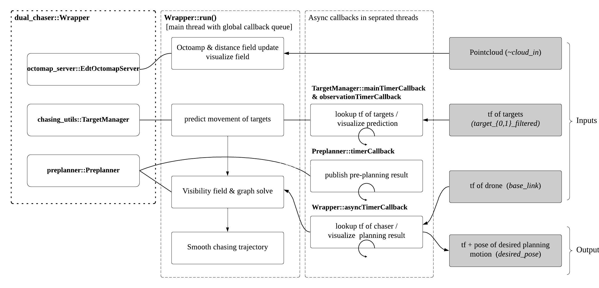

# dual_chaser
 

*Motion planner to chase up **to two** targets in obstacle environment*
[](https://youtu.be/RE6pJ6QvqsA)


## Installation 
* Tested environment: ROS noetic w/ Ubuntu20.04

### Option1. script install 
```
mkdir -p ~/chaser_ws/src
cd ~/chaser_ws/src
git clone https://github.com/icsl-Jeon/dual_chaser.git
./install.sh
```
### Option2. One-by-one building 
#### [traj_gen](https://github.com/icsl-Jeon/traj_gen)

```
git clone https://github.com/coin-or/qpOASES.git
cd qpOASES
mkdir build && cd build
cmake .. -DCMAKE_CXX_FLAGS=-fPIC
sudo make install
git clone https://github.com/icsl-Jeon/traj_gen.git
cd ./traj_gen/cpp
mkdir build && cd build
cmake ..
make && sudo make install
```

#### [dual_chaser_msgs](https://github.com/icsl-Jeon/dual_chaser_msgs)
```
cd ~/catkin_ws/src
git clone https://github.com/icsl-Jeon/dual_chaser_msgs
cd ../
catkin build dual_chaser_msgs 
```

#### [dynamicEDT3D (my fork ver.)](https://github.com/icsl-Jeon/octomap)
```
sudo apt-get install ros-noetic-octomap
git clone https://github.com/icsl-Jeon/octomap
cd octomap/dynamicEDT3D
mkdir build && cmake .. 
sudo make install
```
#### [octomap_server (my fork ver.)](https://github.com/icsl-Jeon/octomap_mapping)
```
cd catkin_ws/src
git clone https://github.com/icsl-Jeon/octomap_mapping
catkin build octomap_server
```

#### [chasing_utils](https://github.com/icsl-Jeon/chasing_utils.git)
```
sudo apt-get install ros-noetic-tf2-sensor-msgs
cd catkin_ws/src
git clone https://github.com/icsl-Jeon/chasing_utils.git
catkin build chasing_utils
```

#### [zed2_client ](https://github.com/icsl-Jeon/zed2_client.git)  (optinal. But required if want to run bag and launch)
```
sudo apt-get install ros-${ROS_DISTRO}-compressed-depth-image-transport
cd catkin_ws/src
git clone https://github.com/stereolabs/zed-ros-wrapper.git
git clone https://github.com/stereolabs/zed-ros-interfaces
git clone https://github.com/icsl-Jeon/zed-ros-examples.git
git clone https://github.com/icsl-Jeon/zed2_client.git
catkin build zed_interfaces rviz_plugin_zed_od zed2_client
```

## Launch 

To test the algorithm, first download one of the [bag files](https://drive.google.com/drive/folders/1AtZIgeRLxQMqIC9SMKBOhj9OXK96uEfw?usp=sharing). 
For the starter, I recommend `forest1.bag`. 
The bags were recorded with a zed2 camera including [object detection messages](https://www.stereolabs.com/docs/ros/object-detection/).
Here, we use [zed2_client](#zed2_client-optinal-httpsgithubcomicsl-jeonzed2_clientgit) 
to provide `/tf` of targets and pointcloud `~cloud_in`.  
Assuming you downloaded `forest1.bag` to `/your/path/to/bag`, modify the `bag_file` argument in [zed_online.launch](launch/zed_online.launch). 
```
  <include file="$(find zed2_client)/launch/client.launch">
        <arg name="is_bag" value="$(arg is_bag)"/>
        <arg name="bag_file" value="/your/path/to/bag/forest1.bag"/>
        <arg name="run_edt" value="false"/>
        <arg name="rviz" value="false"/>
        <arg name="point_topic" value="/cloud_in"/>
        <arg if = "$(arg dual)" name="param_file" value="$(find dual_chaser)/param/zed2_client/circling.yaml"/>
        <arg unless="$(arg dual)" name="param_file" value="$(find dual_chaser)/param/zed2_client/single.yaml"/>
    </include>
```
Then launch the following:
```
roslaunch dual_chaser zed_online.launch is_bag:=true
```

## Required transforms and topic for your usage

### 1. tf 
* World frame `frame_id` to drone (or sensor frame) `drone_frame_id`. Defaults are `map` and `base_link` respectively. 
* World frame to target object frames `{target_0_filtered,target_1_filtered}` (both required in dual target mode. In the single target mode, only the first one is required). 

### 2. topics 
* Pointcloud `~cloud_in` for [EdtOctomapServer](https://github.com/icsl-Jeon/octomap_mapping/blob/kinetic-devel/octomap_server/include/octomap_server/EdtOctomapServer.h)

## Code structure




## Analyzing
The [status message](https://github.com/icsl-Jeon/dual_chaser_msgs) regarding the current planning pose is published 
in the topic `~/wrapper/status`. This can be visualized in [rqt_gui](rviz/monitor.perspective) or in [matlab](rosbag/status_log.m). The rqt perspective file configures the following:

This can be launched by setting     `<arg name="rqt_gui" default="true"/>` as the below [snippet](launch/zed_online.launch)

```
    <arg name="plot_juggler" default="false"/>
    <arg name="rqt_gui" default="true"/>
    <arg name="rviz" default="true"/>
    <arg name="rosbag_status" default="false"/>
    <arg name="dual" default="true"/>
    <arg name= "is_bag" default = "false"/>
```


